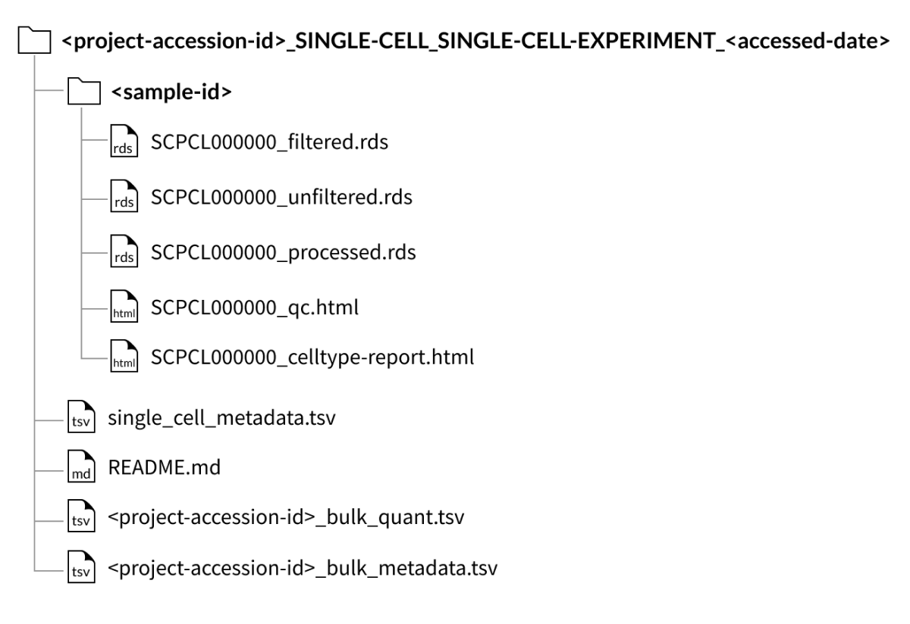
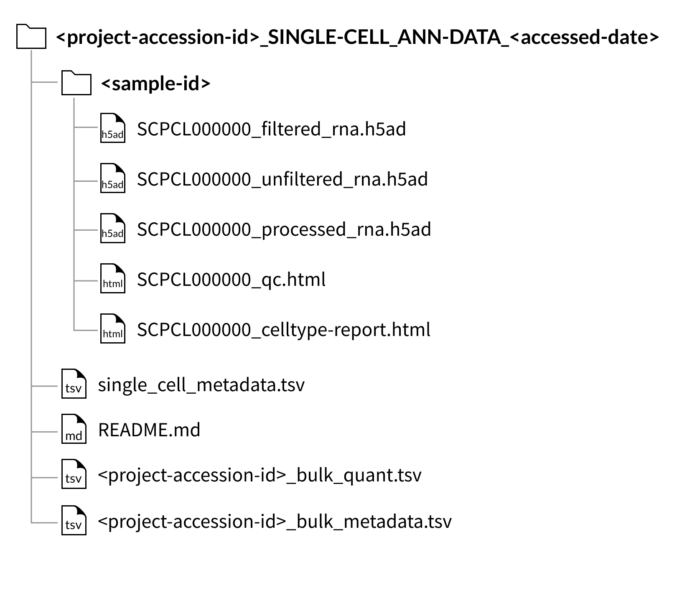
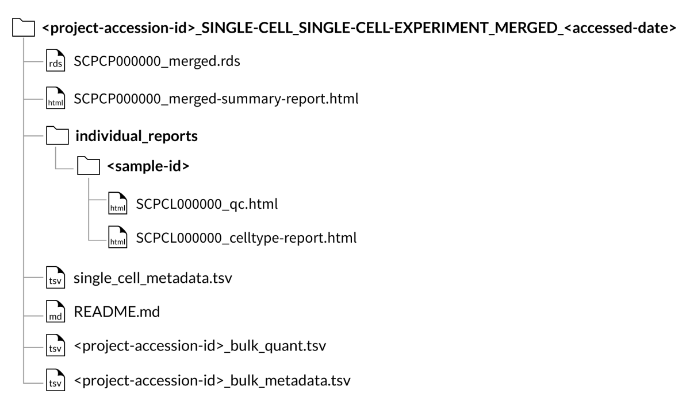
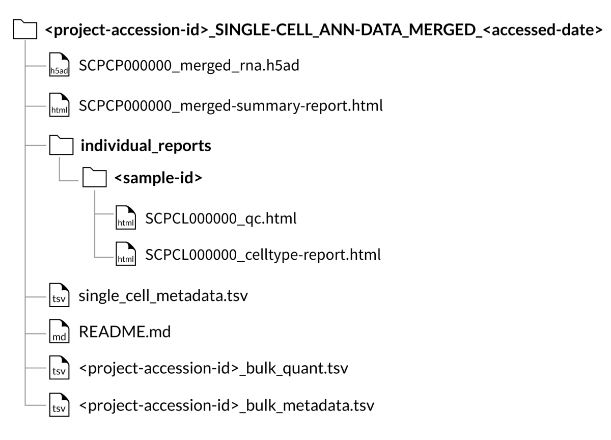
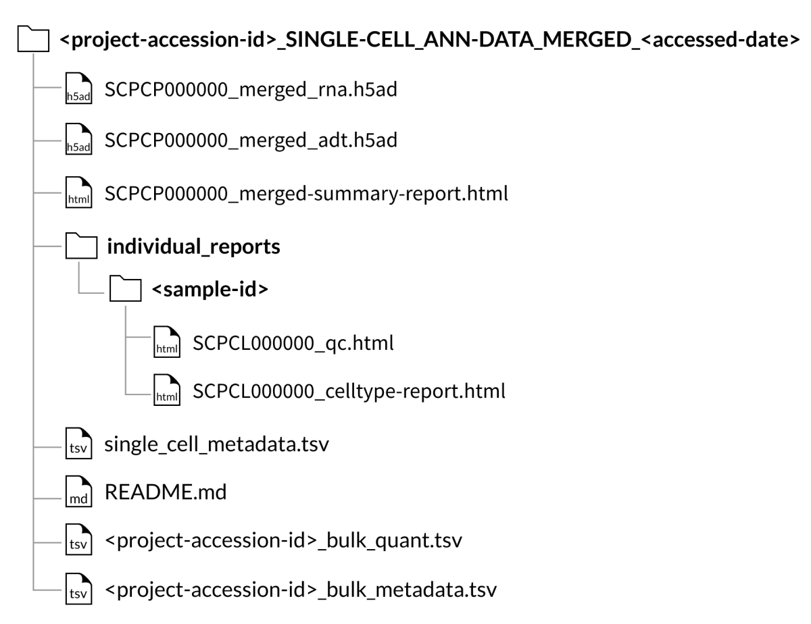
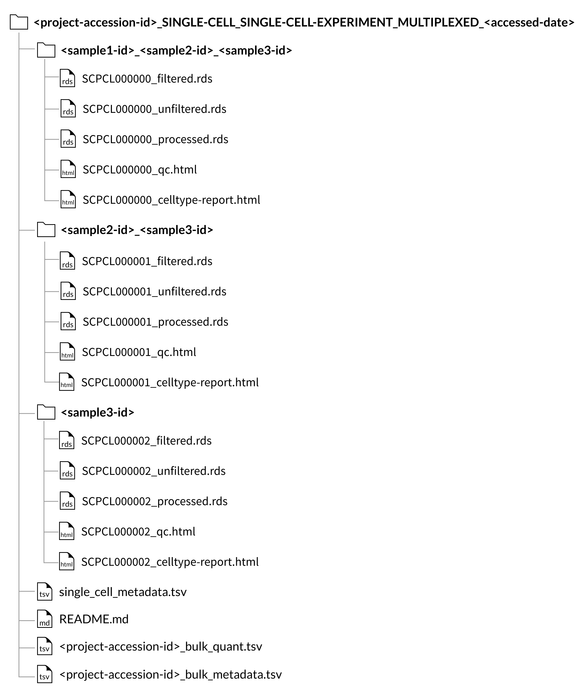
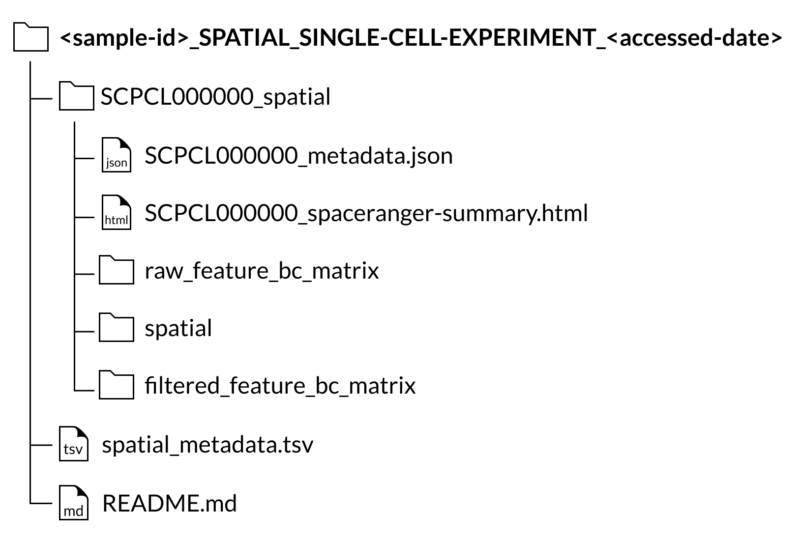

# Downloadable files

The ScPCA Portal download packages include gene expression data, a QC report, and associated metadata for each processed sample.
Gene expression data is available as either [`SingleCellExperiment` objects (`.rds` files)](#download-folder-structure-for-singlecellexperiment-project-downloads) or [`AnnData` objects (`.h5ad` files)](#download-folder-structure-for-anndata-project-downloads).
All downloaded files are delivered as a zip file.
When you uncompress the zip file, the root directory name of your download will include the date you accessed the data on the ScPCA Portal.
We recommend you record this date in case there are future updates to the Portal that change the underlying data or if you need to cite the data in the future (see {ref}`How to Cite <citation:how to cite>` for more information).
Please see our {ref}`CHANGELOG <CHANGELOG:CHANGELOG>` for a summary of changes that impact downloads from the Portal.

Data can be downloaded by either downloading a [single project](#project-downloads), creating a [custom dataset](#custom-datasets), or by choosing one of the [portal-wide download options](#portal-wide-downloads).
For all data downloads, sample folders (indicated by the `SCPCS` prefix) contain the files for all libraries (`SCPCL` prefix) derived from that biological sample.
Most samples only have one library that has been sequenced.
For [multiplexed sample libraries](#multiplexed-sample-libraries), the sample folder name will be an underscore-separated list of all samples found in the library files that the folder contains.
Note that multiplexed sample libraries are only available as `SingleCellExperiment` objects, and are not currently available as `AnnData` objects.

See the {ref}`FAQ section about samples and libraries <faq:What is the difference between samples and libraries?>` for more information.

The files shown below will be included with each library (example shown for a library with ID `SCPCL000000`):
- An unfiltered counts file: `SCPCL000000_unfiltered.rds` or `SCPCL00000_unfiltered_rna.h5ad`,
- A filtered counts file: `SCPCL000000_filtered.rds` or `SCPCL00000_filtered_rna.h5ad`,
- A processed counts file: `SCPCL000000_processed.rds` or `SCPCL00000_processed_rna.h5ad`,
- A quality control report: `SCPCL000000_qc.html`,
- A supplemental cell type report: `SCPCL000000_celltype-report.html`

For more information on the contents of these files, see the sections on [gene expression data](#gene-expression-data), the [QC report](#qc-report), and the [cell type report](#cell-type-report).

Every download also includes a single `single_cell_metadata.tsv` file containing metadata for all libraries included in the download.
For a full description of the metadata file, refer to the [metadata section below](#metadata).

Metadata-only downloads are also available, either by downloading the metadata for all samples in a single project using the `Download Sample Metadata` button or by downloading the [metadata for all samples on the Portal](#metadata-only-downloads).

## Project downloads

Use the `Download Now` button next to the project title to instantly download gene expression data for all samples in a single project.
To download more than one project or combine samples across projects, see the section on [downloading custom datasets](#custom-datasets).

For project downloads, data for all samples will be provided as either [`SingleCellExperiment` objects (`.rds` files)](https://bioconductor.org/books/3.21/OSCA.intro/the-singlecellexperiment-class.html) or [`AnnData` objects (`.h5ad` files)](https://anndata.readthedocs.io/en/latest/index.html).
If the project contains samples with a spatial transcriptomics library, the spatial data will be provided as a separate download.
See the [description of the Spatial transcriptomics output section below](#spatial-transcriptomics-libraries).
For more information on choosing a data format and modality, see the {ref}`documentation on download options<download_options:Download options>`.

If the project contains bulk RNA-seq data, two tab-separated value files, e.g., `SCPCP000000_bulk_quant.tsv` and `SCPCP000000_bulk_metadata.tsv`, will also be included in the project download.
The `SCPCP000000_bulk_quant.tsv` file contains a gene by sample matrix (each row a gene, each column a sample) containing raw gene expression counts quantified by `salmon`.
The `SCPCP000000_bulk_metadata.tsv` file contains associated metadata for all samples with bulk RNA-seq data.
This file will contain fields equivalent to those found in the `single_cell_metadata.tsv` related to processing the sample, but will not contain patient or disease specific metadata (e.g. `age`, `sex`, `diagnosis`, `subdiagnosis`, `tissue_location`, or `disease_timing`).
See also {ref}`processing bulk RNA samples <processing_information:Bulk RNA samples>`.

When downloading a project, you can choose to download data from all samples as individual files, or you can download {ref}`a single file containing all samples merged into a single object<faq:When should I download a project as a merged object?>`.
Below are examples of the expected folder structure when downloading a project with gene expression data from all samples stored in individual files.

### Download folder structure for `SingleCellExperiment` project downloads:
{width="600"}

### Download folder structure for `AnnData` project downloads:
{width="600"}

<!--TODO: Add in project download showing at least one sample with CITE-seq?-->
If downloading a project with samples that contain a CITE-seq library as an `AnnData` object (`.h5ad` file), the quantified CITE-seq expression data is included as a separate file with the suffix `_adt.h5ad`.

### Merged object downloads

Merged object downloads contain all single-cell or single-nuclei gene expression data for a given ScPCA project within a single object, provided as either a [`SingleCellExperiment` object (`.rds` file)](https://bioconductor.org/books/3.21/OSCA.intro/the-singlecellexperiment-class.html) or an [`AnnData` object (`.h5ad` file)](https://anndata.readthedocs.io/en/latest/index.html).

The object file, `SCPCP000000_merged.rds` or `SCPCP000000_merged_rna.h5ad`, contains both a raw and normalized counts matrix, each with combined counts for all samples in an ScPCA project.
In addition to the counts matrices, the `SingleCellExperiment` or `AnnData` object stored in the file includes the results of library-weighted dimensionality reduction using both principal component analysis (PCA) and UMAP.
See the {ref}`section on merged object processing<processing_information:merged objects>` for more information about how merged objects were created.

If downloading a project that contains at least one CITE-seq library, the quantified CITE-seq expression data will also be merged.
In `SingleCellExperiment` objects (`rds` files), the CITE-seq expression data is provided as an alternative experiment in the same object as the gene expression data.
However, for `AnnData` objects, (`.h5ad` files), the quantified CITE-seq expression is instead provided as a separate file called `SCPCP000000_merged_adt.h5ad`.

Every download also includes a single `single_cell_metadata.tsv` file containing metadata for all libraries included in the merged object.
For a full description of this file's contents, refer to the [metadata section below](#metadata).

Every download includes a summary report, `SCPCP000000_merged-summary-report.html`, which provides a brief summary of the samples and libraries included in the merged object.
This includes a summary of the types of libraries (e.g., single-cell, single-nuclei, with CITE-seq) and sample diagnoses included in the object, as well as UMAP visualizations highlighting each library.

Every download also includes the individual [QC report](#qc-report) and, if applicable, [cell type annotation reports](#cell-type-report) for each library included in the merged object.

<!--TODO: Update these images to use new folder titles-->

#### Download folder structure for `SingleCellExperiment` merged downloads:
{width="600"}

#### Download folder structure for `AnnData` merged downloads:
{width="600"}

#### Download folder structure for `AnnData` merged downloads with CITE-seq (ADT) data:
{width="600"}

## Custom datasets

<!--TODO: Fill in this section with information about creating and downloading custom datasets-->

## Portal-wide downloads

The Portal-wide download page can be used to instantly download all [metadata](#metadata-only-downloads) or gene expression data for all samples on the Portal. 

All single-cell and single-nuclei gene expression data from the Portal can be downloaded as a single zip file containing data stored as either [`SingleCellExperiment` objects (`.rds` files)](#singlecellexperiment-portal-wide-download-structure) or [`AnnData` objects (`.h5ad` files)](#anndata-portal-wide-download-structure). 
All spatial data for any samples sequenced using [spatial transcriptomics](#spatial-transcriptomics-libraries) is available separately as a zip file. 

When downloading any of the available Portal-wide data downloads all metadata and associated bulk RNA-seq data is also included. 

<!--TODO: make sure data format naming for files is correctly formatted-->
Each zip file will be named with the the chosen data format (either `SingleCellExperiment` or `AnnData`), and the date you accessed the data on the ScPCA Portal.
Within each zip file will be a folder for each project that contains the gene expression data for all samples in that project as either individual objects or a single [merged object](#portal-wide-downloads-as-merged-objects). 

As with [individual project](#project-downloads) and [custom datasets](#custom-datasets), the quantified CITE-seq expression data will be included when downloading single-cell expression data.
For [`SingleCellExperiment (R)` downloads](#singlecellexperiment-portal-wide-download-structure), the quantified CITE-seq expression is included in the same file as the gene expression data. 
For [`AnnData (Python)` downloads](#anndata-portal-wide-download-structure), the quantified CITE-seq expression data is included as a separate file with the suffix `_adt.h5ad`.

<!--TODO: Update images-->
### `SingleCellExperiment` Portal-wide download structure
{width="600"}

### `AnnData` Portal-wide download structure
{width="600"}

<!--TODO:
spatial section to be moved here
-->

### Portal wide downloads as merged objects

You can choose to download data from all samples as [merged objects with data from all samples in a single project](#merged-object-downloads) by checking "Merge samples into one object per project". 
This download includes a folder for each project that contains a single merged object (`SCPCP000000_merged.rds` or `SCPCP000000_merged.h5ad`), a merged summary report (`SCPCP000000_merged-summary-report.html`), a single [metadata](#metadata) file (`single-cell_metadata.tsv`), and all individual [QC reports](#qc-report) and, if applicable, [cell type annotation reports](#cell-type-report) for each library included in the merged object for that project. 

Note that downloading all data using this option _will not_ download a merged object with all samples from all projects, but a single merged object for each project.

<!--TODO: Update images-->
#### Portal-wide download structure for merged `SingleCellExperiment` objects
{width="600"}

#### Portal-wide download structure for merged `AnnData` objects
{width="600"}

### Metadata-only downloads

The Portal-wide metadata download is a single TSV file containing the metadata for all samples with associated single-cell RNA-seq, single-nuclei RNA-seq, or spatial transcriptomics data available on the Portal.
A table describing all columns included in the file can be found in the [metadata section below](#metadata).

## Gene expression data

Single-cell or single-nuclei gene expression data is provided as either [`SingleCellExperiment` objects (`.rds` files)](https://bioconductor.org/books/3.21/OSCA.intro/the-singlecellexperiment-class.html) or [`AnnData` objects (`.h5ad` files)](https://anndata.readthedocs.io/en/latest/index.html).
Three files will be provided for each library included in the download - an unfiltered counts file, a filtered counts file, and a processed counts file.

The unfiltered counts file, `SCPCL000000_unfiltered.rds` or `SCPCL000000_unfiltered_rna.h5ad`, contains the counts matrix, where the rows correspond to genes or features and the columns correspond to cell barcodes.
Here, all potential cell barcodes that are identified after running {ref}`alevin-fry <processing_information:mapping and quantification using alevin-fry>` are included in the counts matrix.
The object also includes summary statistics for each cell barcode and gene, as well as metadata about that particular library, such as the reference index and software versions used for mapping and quantification.

The filtered counts file, `SCPCL000000_filtered.rds` or `SCPCL000000_filtered_rna.h5ad` contains a counts matrix with the same structure as above.
The cells in this file are those that remain after filtering using {ref}`emptyDrops <processing_information:filtering cells>`.
As a result, this file only contains cell barcodes that are likely to correspond to true cells.

The processed counts file, `SCPCL000000_processed.rds` or `SCPCL000000_processed_rna.h5ad`, contains both the raw and normalized counts matrices.
The filtered counts file is further filtered to remove low quality cells, such as those with a low number of genes detected or high mitochondrial content.
This file contains the raw and normalized counts data for cell barcodes that have passed both levels of filtering.
In addition to the counts matrices, the `SingleCellExperiment` or `AnnData` object stored in the file includes the results of dimensionality reduction using both principal component analysis (PCA) and UMAP.

See {ref}`Single-cell gene expression file contents <sce_file_contents:Single-cell gene expression file contents>` for more information about the contents of the `SingleCellExperiment` and `AnnData` objects and the included statistics and metadata.
See also {ref}`Using the provided RDS files in R <faq:how do i use the provided RDS files in r?>` and {ref}`Using the provided H5AD files in Python <faq:how do i use the provided H5AD files in python?>`.

## QC report

The included QC report, `SCPCL000000_qc.html`, serves as a general overview of each library, including processing information, summary statistics and general visualizations of cell metrics.

## Cell type report

The cell type report, `SCPCL000000_celltype-report.html`, includes an overview of cell type annotations present in the processed objects.
This report contains details on methodologies used for cell type annotation, information about reference sources, comparisons among cell type annotation methods, and diagnostic plots.
For more information on how cell types were annotated, see the section on {ref}`Cell type annotation <processing_information:cell type annotation>`.

If the downloaded library was from a cell line sample, no cell type annotation will have been performed.
Therefore, there will be no cell type report in the download for these libraries.

## Metadata

Included with each download is a `single_cell_metadata.tsv` file containing relevant metadata for each sample included in the download.
Each row corresponds to a unique sample/library combination and contains the following columns:

| column_id       | contents                                                       |
|-----------------|----------------------------------------------------------------|
| `scpca_sample_id` | Sample ID in the form `SCPCS000000`                            |
| `scpca_library_id` | Library ID in the form `SCPCL000000`                          |
| `diagnosis`       | Tumor type                                                     |
| `subdiagnosis`    | Subcategory of diagnosis or mutation status (if applicable)    |
| `disease_timing`  | At what stage of disease the sample was obtained, either diagnosis or recurrence |
| `age`             | Age provided by submitter                                |
| `age_timing`      | Whether age is the age at diagnosis (`diagnosis`), age at collection (`collection`), or `unknown`. This will be `diagnosis` for all samples collected at diagnosis, indicated by the `disease_timing` column |
| `sex`             | Sex of patient that the sample was obtained from               |
| `tissue_location` | Where in the body the tumor sample was located                 |
| `participant_id`  | Unique id corresponding to the donor from which the sample was obtained |
| `submitter_id`    | Original sample identifier from submitter                      |
| `submitter`       | Submitter name/id                                              |
| `organism`         | The organism the sample was obtained from (e.g., `Homo_sapiens`) |
| `development_stage_ontology_term_id` | [`HsapDv`](http://obofoundry.org/ontology/hsapdv.html) ontology term indicating the age at which the sample was collected. `unknown` indicates age is unavailable. |
| `sex_ontology_term_id`| [`PATO`](http://obofoundry.org/ontology/pato.html) term referring to the sex of the sample. `unknown` indicates sex is unavailable. |
| `organism_ontology_id`| NCBI taxonomy term for organism, e.g. [`NCBITaxon:9606`](https://ontobee.org/ontology/NCBITaxon?iri=http://purl.obolibrary.org/obo/NCBITaxon_9606). |
| `self_reported_ethnicity_ontology_term_id` | For _Homo sapiens_ samples, a [`Hancestro` term](http://obofoundry.org/ontology/hancestro.html). `multiethnic` indicates more than one ethnicity is reported. `unknown` indicates unavailable ethnicity and `NA` is used for all other organisms. |
| `disease_ontology_term_id` | [`MONDO`](http://obofoundry.org/ontology/mondo.html) term indicating disease type. [`PATO:0000461`](https://ontobee.org/ontology/PATO?iri=http://purl.obolibrary.org/obo/PATO_0000461) is used for normal or healthy tissue. |
| `tissue_ontology_term_id` | [`UBERON`](http://obofoundry.org/ontology/uberon.html) term indicating tissue of origin. `NA` indicates tissue is unavailable.  |
| `seq_unit`        | `cell` for single-cell samples, `nucleus` for single-nuclei samples, `bulk` for bulk RNA-seq samples, and `spot` for spatial transcriptomics samples. |
| `technology`      | 10x kit used to process library                                |
| `total_reads` | Total number of reads processed by `salmon` |
| `mapped_reads` |  Number of reads successfully mapped |
| `unfiltered_cells` | Total number of cells detected by `alevin-fry` |
| `filtered_cell_count` | Number of cells after filtering with `emptyDrops`          |
| `filtered_cells` | Number of cells after filtering with `emptyDrops`. Only present for multiplexed libraries |
| `processed_cells` | Number of cells after removing low quality cells |
| `has_cellhash` | Boolean indicating if the library has associated cell hashing data |
| `includes_anndata` | Boolean indicating if `AnnData` is available to download for the library |
| `is_cell_line` | Boolean indicating whether or not the sample was obtained from a cell line |
| `is_multiplexed` | Boolean indicating if the library contains multiplexed samples |
| `is_xenograft` | Boolean indicating whether or not the sample was obtained from a patient-derived xenograft |
| `scpca_project_id` | Project ID in the form `SCPCP000000` |
| `pi_name` | Name of primary investigator |
| `project_title` | Title of project |
| `genome_assembly`| Ensembl version of genome used for mapping with `salmon`, `alevin-fry`, or `spaceranger` |
| `mapping_index` | Name of index used for mapping with `salmon`, `alevin-fry`, or `spaceranger` |
| `spaceranger_version` | Version of 10x Genomics' Space Ranger used for mapping, only present for spatial transcriptomics samples |
| `alevin_fry_version` | Version of `alevin-fry` used for gene expression quantification |
| `salmon_version` | Version of `salmon` used for mapping |
| `transcript_type` | Types of counts matrices included in `SingleCellExperiment` or `AnnData` objects. `total` indicates both spliced and unspliced reads are included in the final count, `spliced` indicates only spliced reads are included in the final count |
| `droplet_filtering_method` | The method used for cell filtering. One of `emptyDrops`, `emptyDropsCellRanger`, or `UMI cutoff`  |
| `cell_filtering_method` | Method used by the Data Lab to filter low quality cells prior to normalization. Either `miQC` or `Minimum_gene_cutoff` |
| `prob_compromised_cutoff` | The minimum cutoff for the probability of a cell being compromised, as calculated by `miQC` |
| `min_gene_cutoff` | The minimum cutoff for the number of unique genes detected per cell |
| `normalization_method` | The method used for normalization of raw RNA counts. Either `deconvolution`, described in [Lun, Bach, and Marioni (2016)](https://doi.org/10.1186/s13059-016-0947-7), or `log-normalization` |
| `demux_method` | Methods used to calculate demultiplexed sample numbers. Only present for multiplexed libraries |
| `demux_samples` | Samples included in multiplexed library. Only present for multiplexed libraries |
| `date_processed` | Date sample was processed through `AlexsLemonade/scpca-nf` |

Project-specific metadata will contain all columns listed in the table above and any additional project-specific columns, such as treatment or outcome.
Metadata pertaining to processing will be available in this table and inside of the `SingleCellExperiment` and `AnnData` objects.
See the {ref}`SingleCellExperiment experiment metadata <sce_file_contents:singlecellexperiment experiment metadata>` section for more information on metadata columns that can be found in the `SingleCellExperiment` object.
See the {ref}`AnnData experiment metadata <sce_file_contents:anndata experiment metadata>` section for more information on metadata columns that can be found in the `AnnData` object.

For projects with bulk RNA-seq data, a bulk metadata file (e.g., `SCPCP000000_bulk_metadata.tsv`) will be included for project downloads.
This file will contain fields equivalent to those found in the `single_cell_metadata.tsv` related to processing the sample, but will not contain patient or disease specific metadata (e.g. `age`, `sex`, `diagnosis`, `subdiagnosis`, `tissue_location`, or `disease_timing`).

## Multiplexed sample libraries

For libraries where multiple biological samples were combined via cellhashing or similar technology (see the {ref}`FAQ section about multiplexed samples <faq:What is a multiplexed sample?>`), the organization of the downloaded files and metadata is slightly different.
Note that multiplexed sample libraries are only available as `SingleCellExperiment` objects, and are not currently available as `AnnData` objects.

For project downloads, the counts and QC files will be organized by the _set_ of samples that comprise each library, rather than in individual sample folders.
These sample set folders are named with an underscore-separated list of the sample ids for the libraries within, _e.g._, `SCPCS999990_SCPCS999991_SCPCS999992`.
Bulk RNA-seq data, if present, will follow the [same format as bulk RNA-seq for single-sample libraries](#download-folder-structure-for-project-downloads).

{width="750"}

Because we do not perform demultiplexing to separate cells from multiplexed libraries into sample-specific count matrices, sample downloads from a project with multiplexed data will include all libraries that contain the sample of interest, but these libraries _will still contain cells from other samples_.

For more on the specific contents of multiplexed library `SingleCellExperiment` objects, see the {ref}`Additional SingleCellExperiment components for multiplexed libraries <sce_file_contents:additional singlecellexperiment components for multiplexed libraries>` section.

The [metadata file](#metadata) for multiplexed libraries (`single_cell_metadata.tsv`) will have the same format as for individual samples, but each row will represent a particular sample/library pair, meaning that there may be multiple rows for each `scpca_library_id`, one for each `scpca_sample_id` within that library.
In addition, the `demux_cell_count_estimate` column will contain an estimate of the number of cells from the sample in the library (after demultiplexing) in the sample/library pair.

## Spatial transcriptomics libraries

If a sample includes a library processed using spatial transcriptomics, the spatial transcriptomics output files will be available as a separate download from the single-cell/single-nuclei gene expression data.

For all spatial transcriptomics libraries, a `SCPCL000000_spatial` folder will be nested inside the corresponding sample folder in the download.
Inside that folder will be the following folders and files:

- A `raw_feature_bc_matrix` folder containing the [unfiltered counts files](https://support.10xgenomics.com/spatial-gene-expression/software/pipelines/latest/output/matrices)
- A `filtered_feature_bc_matrix` folder containing the [filtered counts files](https://support.10xgenomics.com/spatial-gene-expression/software/pipelines/latest/output/matrices)
- A `spatial` folder containing [images and position information](https://support.10xgenomics.com/spatial-gene-expression/software/pipelines/latest/output/spatial)
- A `SCPCL000000_spaceranger-summary.html` file containing the [summary html report provided by Space Ranger](https://support.10xgenomics.com/spatial-gene-expression/software/pipelines/latest/output/summary)
- A `SCPCL000000_metadata.json` file containing library processing information.

A full description of all files included in the download for spatial transcriptomics libraries can also be found in the [`spaceranger count` documentation](https://support.10xgenomics.com/spatial-gene-expression/software/pipelines/latest/using/count#outputs).

Every download also includes a single `spatial_metadata.tsv` file containing metadata for all libraries included in the download.

{width="600"}
